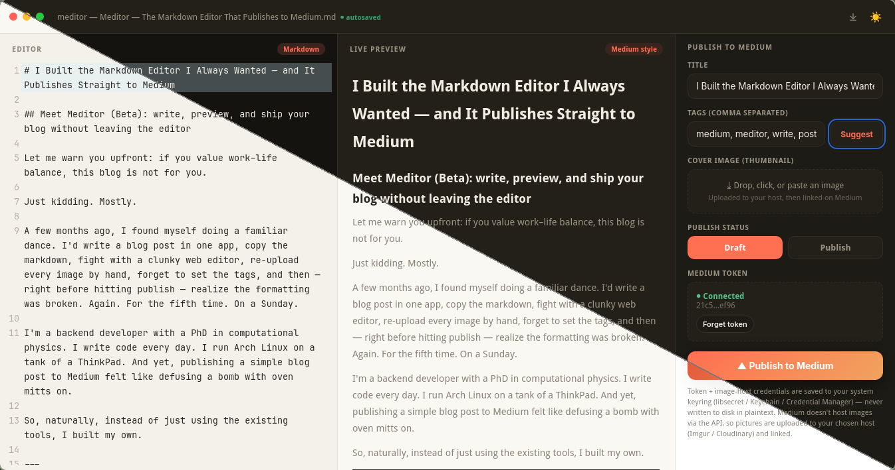

# Meditor — Releases

**A markdown editor that publishes straight to Medium — write, preview, and ship without leaving the app.**

Meditor is a cross-platform desktop editor (Linux, macOS, Windows) built with
**Tauri 2 + Svelte 5**. It pairs a clean markdown writing experience with a
live, Medium-style preview, then publishes your post directly to your Medium
profile.

This repository contains **compiled release packages only**. Source code is
maintained in a separate private repository and is not published here.

## What's New in v1.1.0

- **Private Writing Statistics** — An opt-in, local-only counter that credits
  only what you **actually typed** in the editor. Opened files, restored
  drafts, pasted or dropped text, undo/redo and generated content count for
  zero. Aggregates never leave your machine — they live in app-local storage
  that survives app updates and is never silently reset.
- **100-Trophy Cabinet** — A calm, private achievement list: 50 bronze, 30
  silver and 20 gold trophies. No points, no ranks, no leaderboards, no
  streaks. Includes today/lifetime summaries, a seven-day rhythm chart, and
  status/tier/category filters — all with light/dark themes and accessibility
  support.
- **Successful-publish tracking** — Published posts are recorded in your
  private statistics.
- **Polish** — Icon controls in the title bar, native traffic-light styling,
  indented ordered lists in the live preview, and image-hosting hardening.

## What's New in v1.0.0

- **Inline Image Uploads** — Drag, paste, or click-to-upload images directly into your editor. Images are automatically uploaded and inserted as Markdown image syntax. No more manually hosting images or copy-pasting URLs.
- Full stable release with all core features production-ready.

## Downloads

| Platform | Package | Architecture | Notes |
|----------|---------|--------------|-------|
| macOS | `meditor_1.1.0_aarch64.dmg` | Apple Silicon (M1/M2/M3) | Attached to the v1.1.0 release |
| macOS | `meditor_1.0.0_aarch64.dmg` | Apple Silicon (M1/M2/M3) | Attached to the v1.0.0 release |
| macOS (portable) | `meditor_1.0.0_aarch64_app.zip` | Apple Silicon (M1/M2/M3) | Uncompressed app bundle, attached to the v1.0.0 release |
| Windows | `meditor_1.0.0_x64-setup.exe` | x86_64 | NSIS installer, v1.0.0 |
| Linux (Debian/Ubuntu) | `meditor_1.1.0_amd64.deb` | x86_64 | Attached to the v1.1.0 release |
| Linux (portable) | `meditor_1.1.0_amd64.AppImage` | x86_64 | Attached to the v1.1.0 release. Needs FUSE |
| Linux (Debian/Ubuntu) | `meditor_1.0.0_amd64.deb` | x86_64 | Attached to the v1.0.0 release |
| Linux (portable) | `meditor_1.0.0_amd64.AppImage` | x86_64 | Attached to the v1.0.0 release. Needs FUSE |

## Install

- **Debian/Ubuntu:** `sudo dpkg -i meditor_1.1.0_amd64.deb` or `sudo apt install ./meditor_1.1.0_amd64.deb` (resolves deps automatically).
- **Portable (any Linux):** download `meditor_1.1.0_amd64.AppImage`, `chmod +x`, and run it. Requires FUSE (`fuse2` on Arch, `libfuse2` on Debian/Ubuntu).
- **macOS (Apple Silicon):**
  1. Download `releases/meditor_1.1.0_aarch64.dmg` (or `meditor_1.0.0_aarch64_app.zip` if you
     prefer the uncompressed bundle).
  2. Open the `.dmg` and drag **Meditor** to Applications (or run it directly
     from the mounted volume). If you grabbed `meditor.app`, move it to
     Applications directly.
  3. Because this build is **not yet signed or notarized**, macOS will show a
     Gatekeeper warning ("app is from an unidentified developer"). To run it:
     - **Right-click** the app → **Open**, then click **Open** again, **or**
     - System Settings → Privacy & Security → allow Meditor under
       *"Developer was not identified"*.
- **Windows:** download `releases/meditor_1.0.0_x64-setup.exe` and run it. Because
  the installer is **not yet code-signed**, SmartScreen may warn that it's an
  unrecognized app. Click **More info → Run anyway** to install. Meditor then
  stores your Medium token in Windows Credential Manager.

## Notes for testers

- The Medium integration token is **write-only**: it can publish, but can't
  pull your existing posts back for editing. Edit locally and republish to
  revise.
- Inline image uploads require a configured hosting endpoint. Images are
  uploaded externally and linked in your post.
- The AppImage needs FUSE to run (standard for AppImages; Arch users may need
  `fusermount` from `fuse2`).
- `.deb` is for Debian/Ubuntu. Arch users: an AppImage is provided, and a
  PKGBUILD is on the way.
- **macOS:** Apple Silicon only. Intel Macs require a separate `x86_64` build
  (not yet provided). The macOS build is currently unsigned — see the macOS
  install steps above to bypass Gatekeeper.

## Feedback

v1.0.0 is the first stable release and we'd love your input. Found a bug, or
want a feature? Reach out to the maintainer directly — it shapes what gets
built next.
